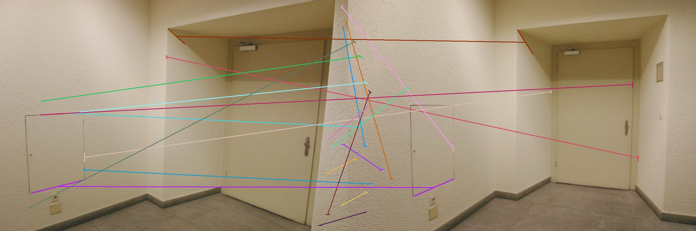

# 📝 Simple Line Segment Matching

---

Despite the huge amount of resources about keypoint matching, lesser interest has been shown for line segment matching.
Hence, this repository shows some samples related to basic concepts of line segments:

- Detect line segments using opencv's cv2.ximgproc.createFastLineDetector. The algorithm behind this method is from [HERE](https://ieeexplore.ieee.org/document/6907675).
  This method detects line segments specified by their two end points.
- Draw line segment's line support region.
- Extract [Line Band Descriptor](https://www.sciencedirect.com/science/article/abs/pii/S1047320313000874) and match based on the extracted descriptors.

## :running: How to Run

---

- Download sample data:

```bash
wget https://raw.githubusercontent.com/kailigo/LineMatchingBenchmark/master/benchmark/textureless_corridor/1.png -O ./data/textureless_corridor_1.png
wget https://raw.githubusercontent.com/kailigo/LineMatchingBenchmark/master/benchmark/textureless_corridor/2.png -O ./data/textureless_corridor_2.png
```

- Draw detected line segments and their line support regions

```bash
python3 scripts/test_line_segment_detection.py --input ./data/textureless_corridor_1.png
```


- Detect and match line segments (The matching method is quite primitive so the matching accuracy is not high).

```bash
python3 scripts/test_line_segment_matching.py --query_path ./data/textureless_corridor_1.png --ref_path ./data/textureless_corridor_2.png
```



## 🎛 Development environment

---

```bash
mamba env create --file environment.yml
mamba activate lsmh
```

## :gem: References

---

- [Line Segment Matching: A Benchmark](https://kailigo.github.io/projects/LineMatchingBenchmark)
- [Learning to Parse Wireframes in IMages of Man-Made Environments, CVPR 2018](https://github.com/huangkuns/wireframe)
- [Line Segment Detection: a Review of the 2022 State of the Art](https://www.ipol.im/pub/art/2024/481/article.pdf)
